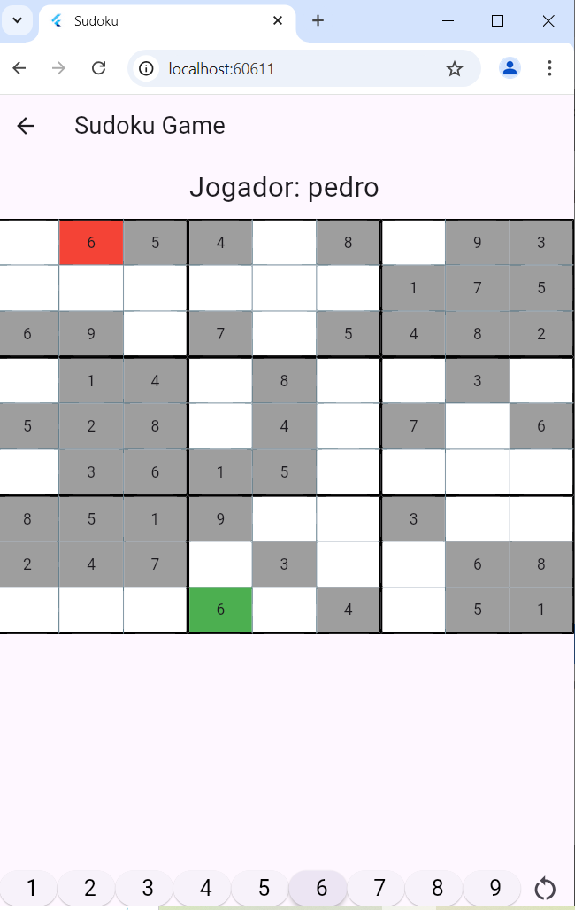

🧩 Sudoku em Flutter

Aplicativo de Sudoku desenvolvido em Flutter, utilizando a API sudoku_dart para geração dos tabuleiros. O jogo permite ao jogador inserir seu apelido, escolher a dificuldade e jogar Sudoku seguindo as regras clássicas.

🎮 Funcionalidades

Entrada do apelido do jogador

Seleção de dificuldade (Easy, Medium, Hard, Expert)

Geração automática de tabuleiro 9x9

Validação das jogadas conforme regras do Sudoku

Destaque em vermelho para números inválidos

Botão Novo Jogo

Mensagem indicando conclusão correta ou incorreta do jogo

📐 Regras do Sudoku

Não repetir números em linhas

Não repetir números em colunas

Não repetir números em subgrupos 3x3

🔌 API Utilizada

sudoku_dart
https://pub.dev/packages/sudoku_dart

📁 Estrutura Entregue

Pasta lib

Pasta images

Arquivo pubspec.yaml

Print da aplicação em execução (Android, Web ou Desktop)

▶️ Execução
flutter pub get
flutter run

Imagem do Jogo

